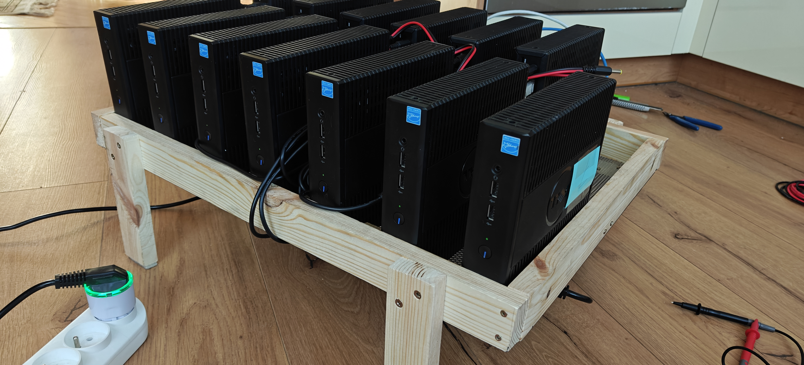
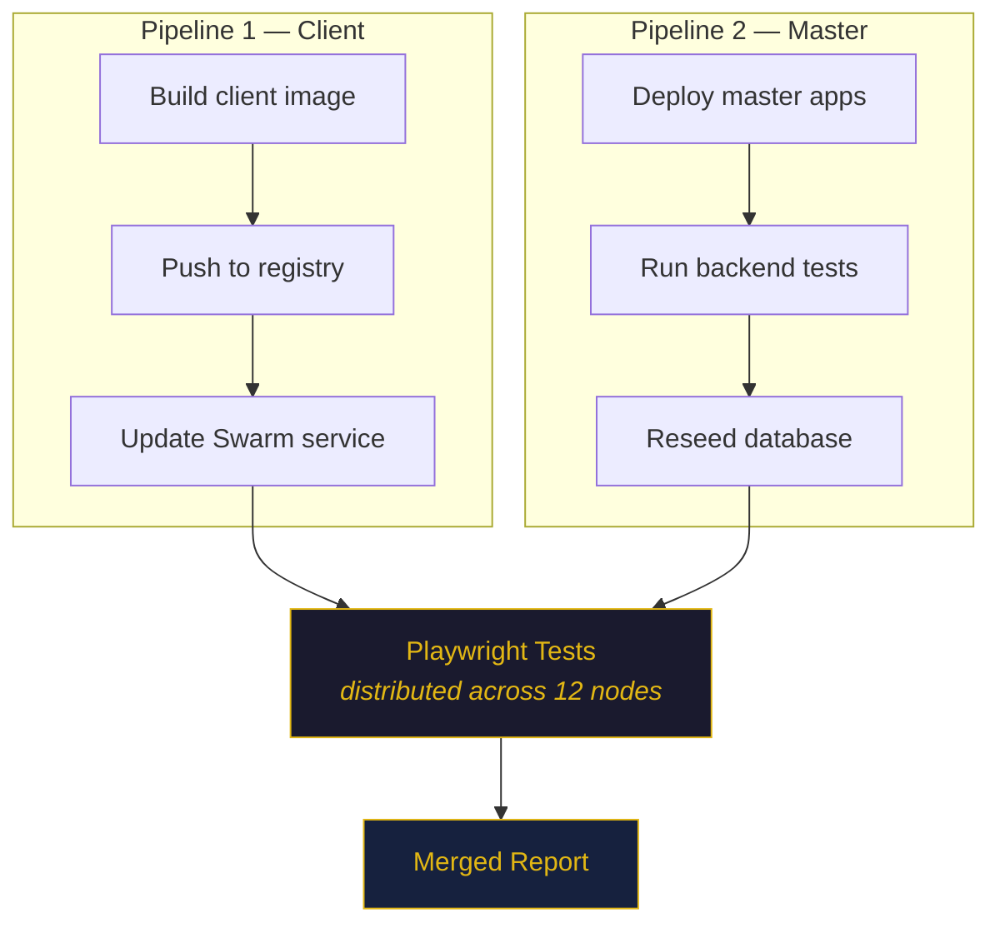

# The Minifarm

**A distributed testing infrastructure built from 12 Dell WYSE thin clients, Docker Swarm, and a handmade wooden rack.**

<p align="center">
  <a href="https://minifarm-nine.vercel.app/"><strong>→ LIVE ABOUT</strong></a>
</p>

<p align="center">
  
</p>

<p align="center">
  <sub>Wooden rack designed and built by <a href="https://github.com/soquel">@soquel</a></sub>
</p>

## What is this?

An Ubuntu laptop serves as the master node, running a private Docker registry, the full application stack under test, and a test orchestration server. Twelve Dell WYSE 5070 thin clients — sourced as retired corporate hardware — act as worker nodes, each running Alpine Linux with Chromium and Playwright inside containers deployed via Docker Swarm.

The system includes a real-time dashboard, a CLI for triggering full pipeline runs, and an SSE-based streaming architecture that bridges CLI output to the browser in real time.

## What problem does it solve?

Before this project, our small team had no CI/CD pipeline. Every end-to-end test from a growing monolith had to be run manually on a developer's local machine — one test at a time, blocking their workstation for the duration. The Minifarm replaced that with a single button click in the dashboard: select a branch, hit start, and the entire test suite runs in parallel across 12 dedicated machines while you keep working.

## Bird's eye view

```
  ┌──────────────────────────────────────┐
  │  MASTER NODE                         │
  │    Ubuntu 24 Laptop                  │
  │    minifarm-master.local             │
  │                                      │
  │    ├─ Docker Swarm Manager           │
  │    ├─ Private Registry :5000         │
  │    ├─ Test Orchestrator :3801        │
  │    ├─ Dashboard (React)              │
  │    └─ App Stack (Docker Compose)     │
  └──────────────────┬───────────────────┘
                     │
              ┌──────┴──────┐
              │  ethernet   │
              └──────┬──────┘
                     │
          ┌──────────┴──────────┐
          │   network switch    │
          └──────────┬──────────┘
                     │
   ┌──┬──┬──┬──┬──┬──┼──┬──┬──┬──┬──┐
   │  │  │  │  │  │  │  │  │  │  │  │
   01 02 03 04 05 06 07 08 09 10 11 12

      < 12x Dell WYSE 5070 thin clients >
      Alpine Linux | Docker | Playwright
      2 parallel workers each = 24 slots
```

A test run follows two parallel pipelines that converge before test execution:



## Tech Stack

| Layer | Technology |
|-------|-----------|
| CLI | Node.js, yargs, [hwp](https://www.npmjs.com/package/hwp) (bounded-concurrency async iteration) |
| Server | Node.js, Express, SSE (Server-Sent Events) |
| Client | Node.js, Express, Playwright, pbzip2 |
| Dashboard | React 19, TypeScript, Vite, Tailwind CSS, shadcn/ui |
| Orchestration | Docker Swarm (1 manager + 12 workers) |
| Test Framework | Playwright with Chromium |
| Discovery | mDNS (.local hostnames) |
| Compression | pbzip2 (parallel bzip2 for report transfer) |

## Key Decisions

- **Two parallel deployment pipelines** — Client container builds and master app deployments run concurrently using `Promise.allSettled`, with Playwright tests gated on both completing. The `hwp` library provides bounded-concurrency async iteration for git checkouts and env file updates.

- **SSE-based real-time streaming** — Not WebSockets (no bidirectional need), not polling (too slow). The CLI emits structured `[stage] message` log lines that the pipeline executor parses and forwards as typed SSE events (`stage:started`, `stage:complete`, `log`) to the dashboard.

- **Structured log protocol** — A `[stage-name] message` prefix convention bridges the CLI process's stdout to the dashboard's pipeline progress UI. The executor parses these prefixes, tracks stage state machines, and emits granular SSE events.

- **Work-stealing test distribution with scatter scheduling** — Each client gets N worker slots (default: 2). Slots are staggered with random delays (`TEST_SCATTER_INTERVAL`) to avoid thundering herd on the server. When a worker finishes a test, it recursively pulls the next pending test — a simple but effective work-stealing pattern.

- **MD5 cache invalidation** — Before and after git checkout, `package-lock.json` files are checksummed with MD5. Only apps whose dependency checksums changed get `npm install`, saving significant time on incremental deployments.

- **Static client configuration** — Clients are defined in a `clients.json` file with hostnames, MAC addresses, and worker counts. This was chosen over dynamic registration because Docker overlay network IPs are ephemeral — clients behind the overlay would register with `10.0.x.x` addresses unreachable from the master. Static config with mDNS hostnames (.local) is simple and reliable.

- **Disk-persisted state with crash recovery** — The test queue and pipeline state are written to disk as JSON after every mutation. On server restart, any batch marked `running` is automatically transitioned to `incorrect` status, preventing zombie state.

- **Blob report merging** — Each client produces a Playwright blob report (compressed with pbzip2). After all tests complete, the server collects blob `.zip` files from all report directories and runs `npx playwright merge-reports` to produce a unified HTML report.

## Dashboard

The dashboard provides real-time visibility into the test pipeline with live progress updates via SSE. It includes:

- **Pipeline progress** — Stage-by-stage view with live log streaming
- **Test queue** — Current and historical test batches with pass/fail counts
- **Test configuration** — Grep filter patterns and project selection


## Components

**CLI** (`cli/`) — The main orchestration tool. Triggered with `./minifarm.js test <branch>`, it runs two parallel pipelines: one builds and deploys the client Docker image across the Swarm, the other deploys the application stack on the master. Once both complete, it triggers distributed Playwright tests and polls for completion.

**Server** (`server/`) — The test orchestration server running on the master node. Manages the test queue, distributes tests to clients using work-stealing, collects and merges blob reports, and streams pipeline progress via SSE.

**Client** (`client/`) — A lightweight Express server running inside each Docker container on the worker nodes. Receives test execution requests, runs Playwright against the application stack on the master, and returns compressed blob reports.

**Dashboard** (`dashboard/`) — A React SPA providing real-time pipeline monitoring. Connects to the server via SSE for live updates.

## License

MIT

---

> **Note:** This project is tightly coupled to the internal application stack it was built to test. It is published here for reference, not as a reusable tool.
